<!-- README.md is generated from README.Rmd. Please edit that file -->

# geohabnet

This package is expanded upon [Xing et al
(2021)](https://academic.oup.com/bioscience/article/70/9/744/5875255).
It add capabilities to customize parameter values using functions and
see results of cropland connectivty risk index in the form of plots. The
goal of geohabnet is to enable users to visualize cropland connectivity
risk index using their own parameter values.

## Installation

You can install the development version of geohabnet from
[GitHub](GarrettLab/CroplandConnectivity) with:

``` r
# install.packages("devtools")
devtools::install_github("GarrettLab/CroplandConnectivity", subdir = "geohabnet")
```

## Example

This is a basic example which shows you how to solve a common problem:

``` r
library(geohabnet)

param_file <- geohabnet::get_parameters()
#> [1] "parameters fetched successfully"
#now edit the file
geohabnet::set_parameters(new_parameters_file = param_file)
#> /private/var/folders/r5/zggvft9d3yn5kh51wqp78rd00000gn/T/RtmpwZccVD/temp_libpath308c38a51ec6/geohabnet/parameters.yamlTRUE
#> [1] TRUE
geohabnet::senstivity_analysis()
#> /private/var/folders/r5/zggvft9d3yn5kh51wqp78rd00000gn/T/RtmpwZccVD/temp_libpath308c38a51ec6/geohabnet/parameters.yamlTRUE
#> Running senstivity analysis for the extent: [ -115 -75 5 32 ],
#>       Link threshold:  0 Host density threshold:  0.0015
```


    #> Warning in mean_index_raster + ext_zero: Raster objects have different extents.
    #> Result for their intersection is returned

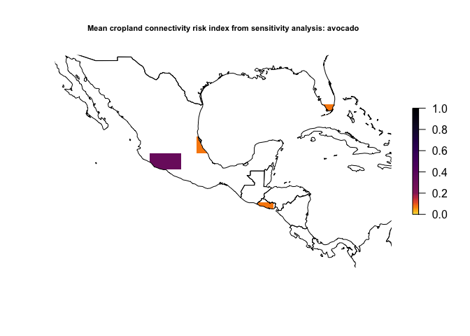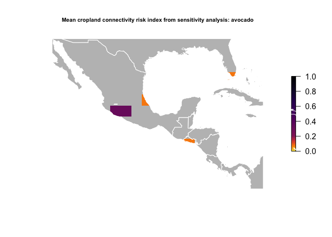

    #> Warning in variance_mean_index_raster_ext_disagg + zero_extent_raster: Raster
    #> objects have different extents. Result for their intersection is returned


    #> Warning in mean_index_raster_diff_disagg + zero_extent_raster: Raster objects
    #> have different extents. Result for their intersection is returned

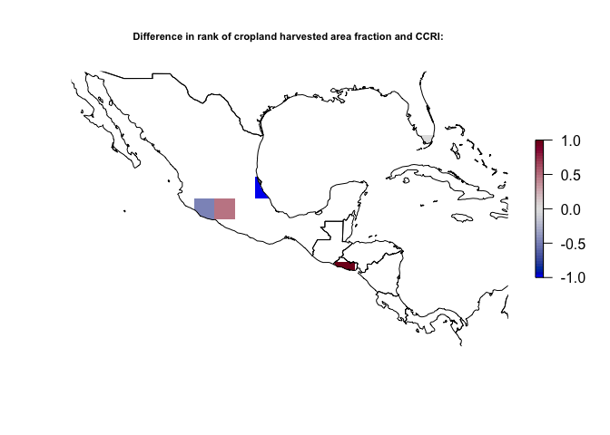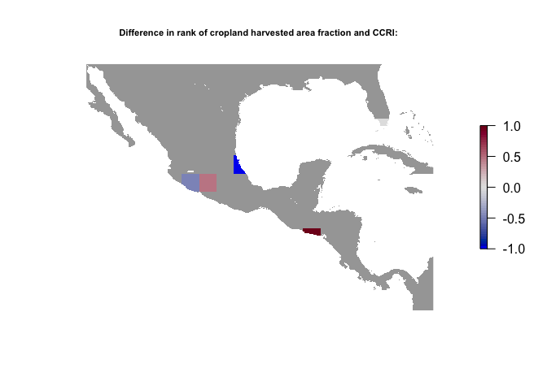

    #> 
    #> Running senstivity analysis for the extent: [ -115 -75 5 32 ],
    #>       Link threshold:  0 Host density threshold:  0.002


    #> Warning in mean_index_raster + ext_zero: Raster objects have different extents.
    #> Result for their intersection is returned

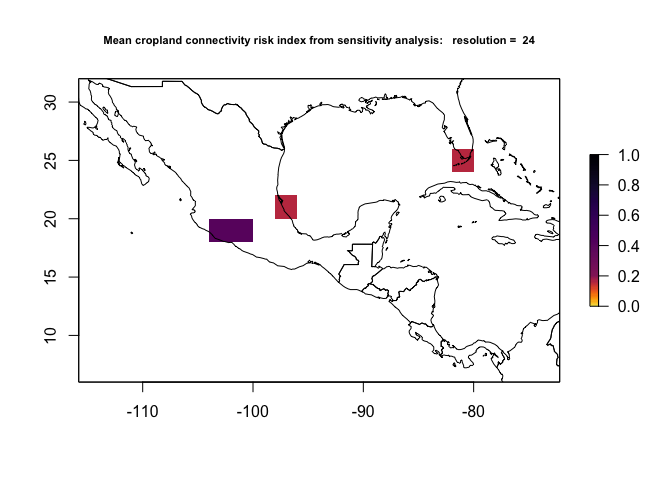

    #> Warning in variance_mean_index_raster_ext_disagg + zero_extent_raster: Raster
    #> objects have different extents. Result for their intersection is returned


    #> Warning in mean_index_raster_diff_disagg + zero_extent_raster: Raster objects
    #> have different extents. Result for their intersection is returned

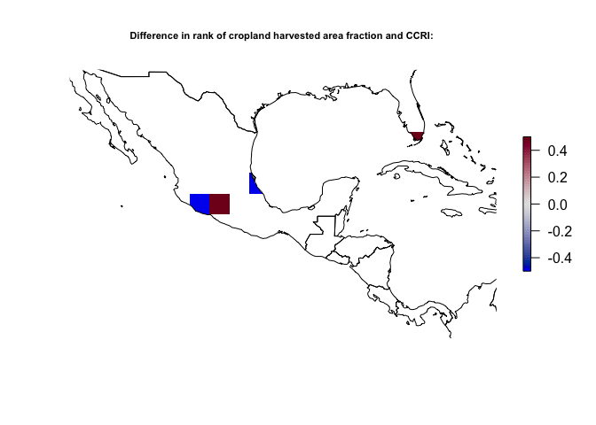

    #> 
    #> Running senstivity analysis for the extent: [ -115 -75 5 32 ],
    #>       Link threshold:  0 Host density threshold:  0.0025


    #> Warning in mean_index_raster + ext_zero: Raster objects have different extents.
    #> Result for their intersection is returned

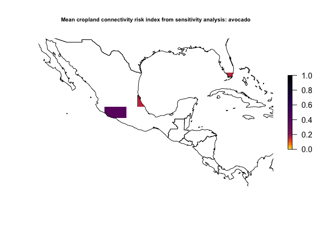

    #> Warning in variance_mean_index_raster_ext_disagg + zero_extent_raster: Raster
    #> objects have different extents. Result for their intersection is returned

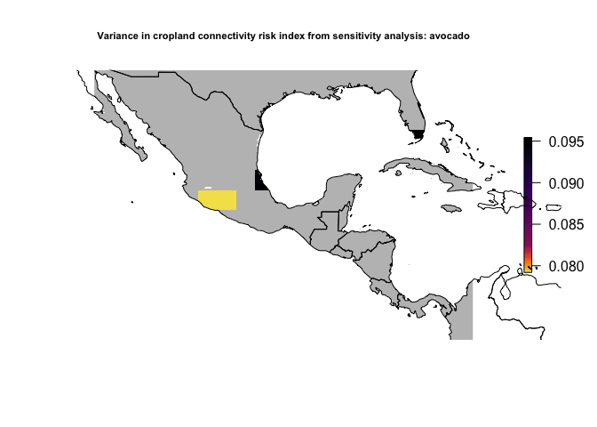

    #> Warning in mean_index_raster_diff_disagg + zero_extent_raster: Raster objects
    #> have different extents. Result for their intersection is returned


    #> 
    #> Running senstivity analysis for the extent: [ -115 -75 5 32 ],
    #>       Link threshold:  1e-06 Host density threshold:  0.0015


    #> Warning in mean_index_raster + ext_zero: Raster objects have different extents.
    #> Result for their intersection is returned

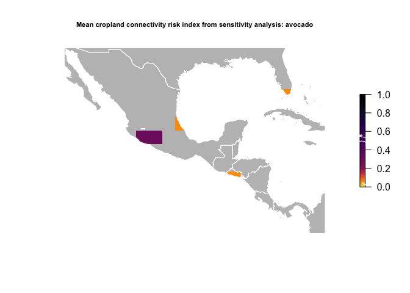

    #> Warning in variance_mean_index_raster_ext_disagg + zero_extent_raster: Raster
    #> objects have different extents. Result for their intersection is returned

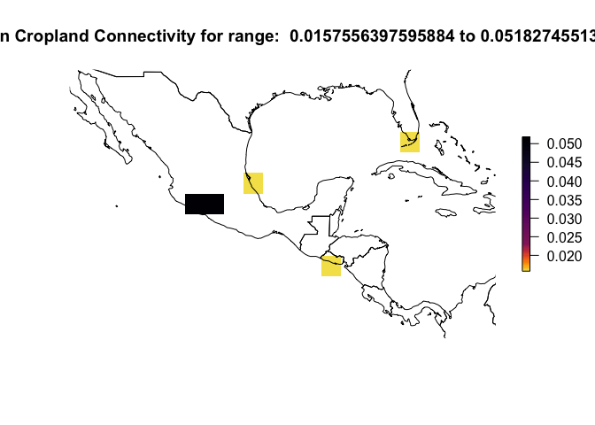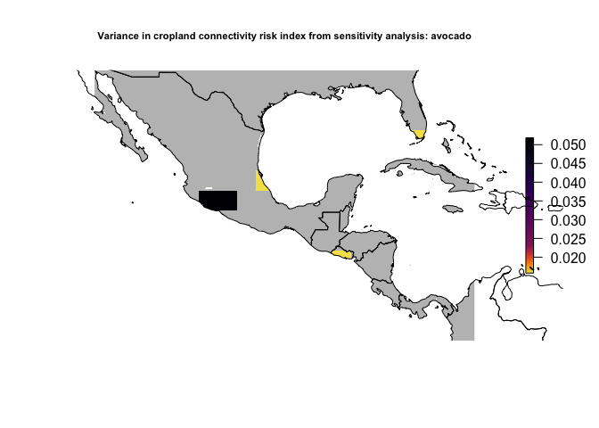

    #> Warning in mean_index_raster_diff_disagg + zero_extent_raster: Raster objects
    #> have different extents. Result for their intersection is returned


    #> 
    #> Running senstivity analysis for the extent: [ -115 -75 5 32 ],
    #>       Link threshold:  1e-06 Host density threshold:  0.002


    #> Warning in mean_index_raster + ext_zero: Raster objects have different extents.
    #> Result for their intersection is returned

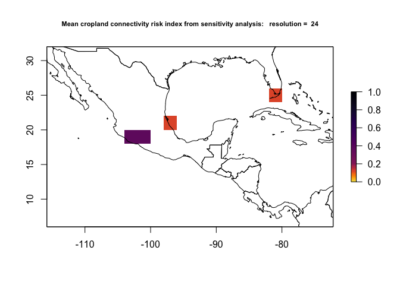

    #> Warning in variance_mean_index_raster_ext_disagg + zero_extent_raster: Raster
    #> objects have different extents. Result for their intersection is returned

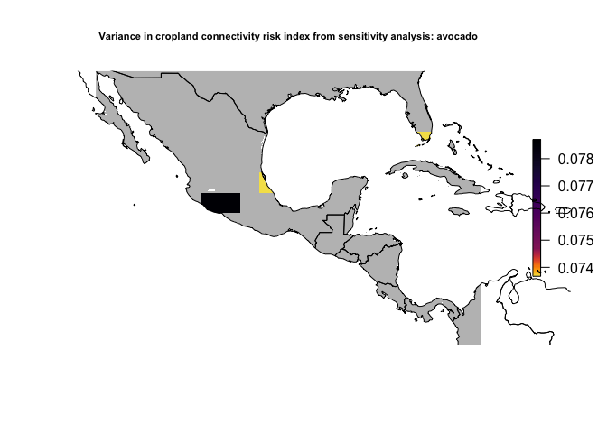

    #> Warning in mean_index_raster_diff_disagg + zero_extent_raster: Raster objects
    #> have different extents. Result for their intersection is returned


    #> 
    #> Running senstivity analysis for the extent: [ -115 -75 5 32 ],
    #>       Link threshold:  1e-06 Host density threshold:  0.0025


    #> Warning in mean_index_raster + ext_zero: Raster objects have different extents.
    #> Result for their intersection is returned

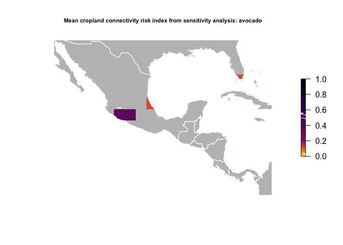

    #> Warning in variance_mean_index_raster_ext_disagg + zero_extent_raster: Raster
    #> objects have different extents. Result for their intersection is returned


    #> Warning in mean_index_raster_diff_disagg + zero_extent_raster: Raster objects
    #> have different extents. Result for their intersection is returned

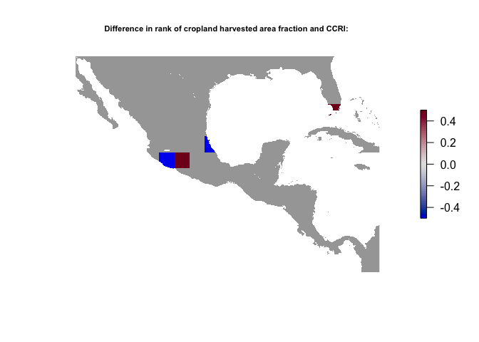

    #> 
    #> Running senstivity analysis for the extent: [ -115 -75 5 32 ],
    #>       Link threshold:  6e-04 Host density threshold:  0.0015

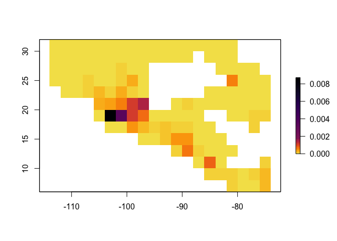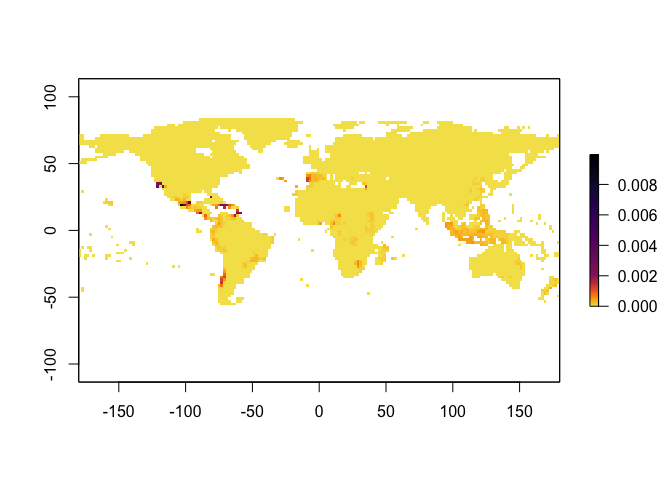

    #> Warning in mean_index_raster + ext_zero: Raster objects have different extents.
    #> Result for their intersection is returned

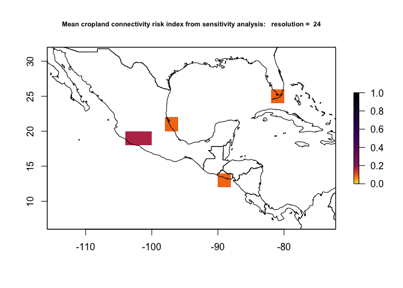

    #> Warning in variance_mean_index_raster_ext_disagg + zero_extent_raster: Raster
    #> objects have different extents. Result for their intersection is returned


    #> Warning in mean_index_raster_diff_disagg + zero_extent_raster: Raster objects
    #> have different extents. Result for their intersection is returned


    #> 
    #> Running senstivity analysis for the extent: [ -115 -75 5 32 ],
    #>       Link threshold:  6e-04 Host density threshold:  0.002


    #> Warning in mean_index_raster + ext_zero: Raster objects have different extents.
    #> Result for their intersection is returned


    #> Warning in variance_mean_index_raster_ext_disagg + zero_extent_raster: Raster
    #> objects have different extents. Result for their intersection is returned


    #> Warning in mean_index_raster_diff_disagg + zero_extent_raster: Raster objects
    #> have different extents. Result for their intersection is returned


    #> 
    #> Running senstivity analysis for the extent: [ -115 -75 5 32 ],
    #>       Link threshold:  6e-04 Host density threshold:  0.0025


    #> Warning in mean_index_raster + ext_zero: Raster objects have different extents.
    #> Result for their intersection is returned

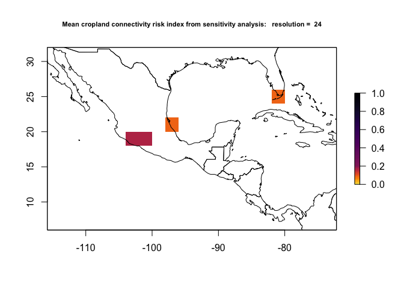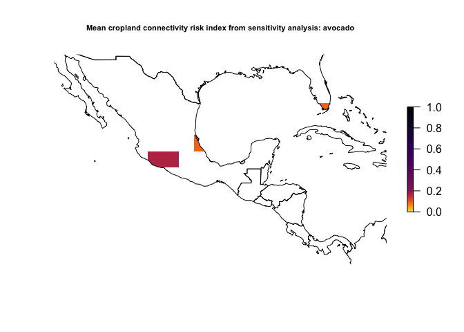

    #> Warning in variance_mean_index_raster_ext_disagg + zero_extent_raster: Raster
    #> objects have different extents. Result for their intersection is returned

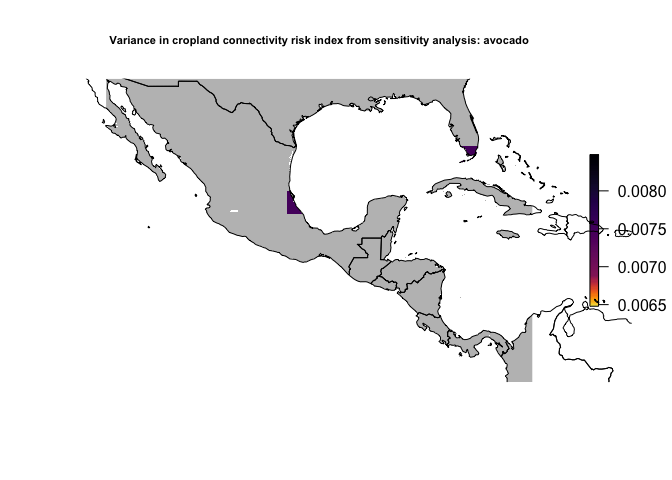

    #> Warning in mean_index_raster_diff_disagg + zero_extent_raster: Raster objects
    #> have different extents. Result for their intersection is returned


    #> [[1]]
    #> [[1]][[1]]
    #> [[1]][[1]][[1]]
    #> [1] FALSE
    #> 
    #> [[1]][[1]][[2]]
    #> [1] FALSE
    #> 
    #> [[1]][[1]][[3]]
    #> [1] FALSE
    #> 
    #> 
    #> [[1]][[2]]
    #> [[1]][[2]][[1]]
    #> [1] FALSE
    #> 
    #> [[1]][[2]][[2]]
    #> [1] FALSE
    #> 
    #> [[1]][[2]][[3]]
    #> [1] FALSE
    #> 
    #> 
    #> [[1]][[3]]
    #> [[1]][[3]][[1]]
    #> [1] FALSE
    #> 
    #> [[1]][[3]][[2]]
    #> [1] FALSE
    #> 
    #> [[1]][[3]][[3]]
    #> [1] FALSE
