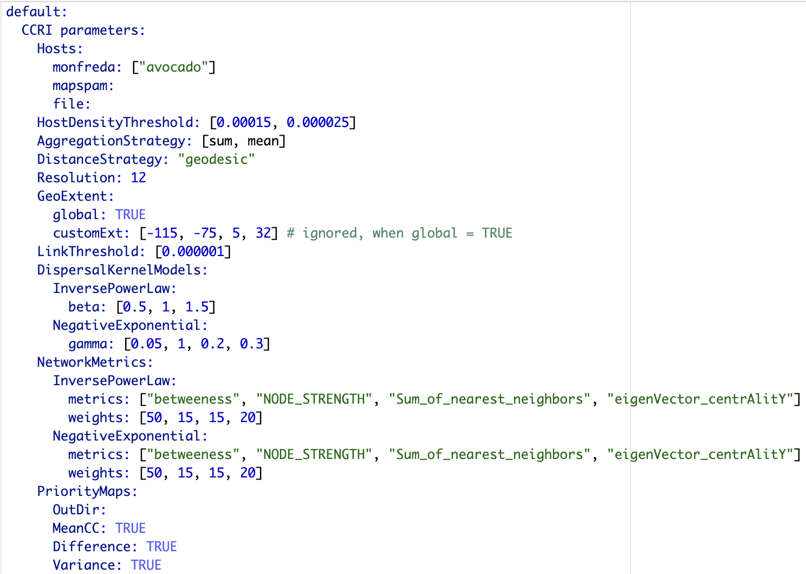

```{r, include = FALSE}
knitr::opts_chunk$set(
  collapse = TRUE,
  comment = "#>"
)
```

# Abstract

A habitat network and the habitat connectivity of locations in a landscape can be used to analyze the potential spread of a species such as plant pathogens, plant pests, human pathogens, invasive species, or endangered species. Several factors can affect the connectivity of habitat locations such as host availability, favorable climate, and the species, dispersal ability. Understanding the structure of a habitat network is important crucial for evaluating the potential spread of a species and thus its connectivity. Although croplands may be geographically connected, the risk cannot be generalized as pathogen may not spread if it's exclusive to specific crop. [@geohabnet] supports up to 10 parameters that has potential to impact risk and connectivity among croplands. The implementation is expanded upon [@xing2020], which discusses global cropland connectivity. This framework uses default values from the paper at the same time making them as parameters and eventually turning it into framework for the analysis of crops.

Although this article is focused on usage, it is useful to know for interested developers that package design is inspired from widely used Configuration-based design in software development [@sre_book], [@nash2009], and [@config] provides a text based interface to control the parameters values for risk analysis in this context.

Primary objective of this vignette is to help user in getting started, list capabilities and intuition behind them. It also describes underlying implementation at high level to support the intuition behind functions. Throughout the article, we will citing external sites and resources which is relevant to usage of this package.

# Pre-requisites

## Definitions

-   Raster - Raster is a digital encoding of 2D digital image with underlying pixels as underlying. It also encapsulates other details like resolution, dimensions etc which is useful in identification and processing. Here, we use raster to represent maps.

-   TIFF(Tag Image File Format) is a file that stores raster and information.

## External materials

-   Download and install R, R Studio - [https://rstudio-education.github.io/hopr/starting.html/](https://rstudio-education.github.io/hopr/starting.html){.uri}

-   Raster - <https://www.adobe.com/creativecloud/file-types/image/raster.html>

-   TIFF - [https://www.adobe.com/creativecloud/file-types/image/raster/tiff-file.html/](https://www.adobe.com/creativecloud/file-types/image/raster/tiff-file.html){.uri}

## Data sets

We use publicly available sources to obtain crop information -

-   [Monfreda](http://www.earthstat.org/harvested-area-yield-175-crops/) [@monfreda2008]

-   [MapSpam (2010, 2017)](https://dataverse.harvard.edu/dataset.xhtml?persistentId=doi:10.7910/DVN/PRFF8V) [@internationalfoodpolicyresearchinstitute2019]

Geodata provides set of APIs to access these data-sets. For visualization and plots, we use [rnaturalearth](https://docs.ropensci.org/rnaturalearth/).

# Quick Start

## Meta information

-   Package information - <https://garrettlab.github.io/HabitatConnectivity/>
-   CRAN site - <https://CRAN.R-project.org/package=geohabnet>
-   Source code - <https://github.com/GarrettLab/HabitatConnectivity/tree/main/geohabnet/>
-   Report issues - [https://github.com/GarrettLab/CroplandConnectivity/issues/](https://github.com/GarrettLab/HabitatConnectivity/issues/){.uri}
-   Lab website - <https://www.garrettlab.com/>

## Installation and loading

Installing `geohabnet` will also install its dependencies. Please see the list of dependencies using `desc::desc(package = "geohabnet")`

```{r eval = FALSE}
if (!require("devtools")) {
  install.packages("devtools")
}
```

```{r cran, eval=FALSE}

if (!require("geohabnet")) {
  utils::install.packages("geohabnet")
}
```

Alternatively, install from github source.

```{r github}
library("devtools")

if (!require("geohabnet")) {
  install_github("GarrettLab/HabitatConnectivity", subdir = "geohabnet")
}
```

```{r message=FALSE}
library(geohabnet)
```

At any point, access the help page using following -

```{r message=FALSE}
?geohabnet
# and
?geohabnet::msean # any function
```

## Run analysis on default configuration

This is to run the analysis on default set of values for the supported parameters. Initially, the values are set based on the Xing et al(2021) [@xing2020] and crop is *Avocado*. This would run the workflow on global geographical extent quickly since the crop presence is relatively low.

```{r message=FALSE}
res <- sensitivity_analysis()
```

The results are the side effects and the similar information is captured in the object returned from it. Its based on the values set for each of the parameters which we will see in details in the further sections.

## Running new analysis

We provide 2 methods or entry points to run analysis by setting new values for the supported parameters.

### Setting values in a function

The goal of the this function is to provide simple invasive factors as parameters. The internal implementation and program deals with object of `terra` [@terra] and `igraph`[@igraph] . The primary object is of type `SpatRaster` from `terra` . To get started, we will use quick way to obtain raster and later we will understand the details.

An effective way to look-up is search_crop(). It will return sources which contains the data-set for this crop.

```{r message=FALSE}

avocado <- cropharvest_rast("avocado", "monfreda")

# verify the raster object
avocado
gplot(avocado)
```

Now that we have a raster object, it can be fed directly to the workflow. We will only set the required parameter - *rast*. The value represents *Avocado* plantation in geographical area of North America.

```{r message=FALSE}
geo_net <- msean(avocado)
```

The functions `msean` is same as `sean` except msean has side effects and they return different S4 objects, `GeoNetwork` and `GeoRasters` respectively. We will use them interchangeably in this article. The results should be interpreted in accordance to the values of other parameters that have factored as arguments to `sean`. Run ?sean to see all the supported parameters. We will later see the usage of other parameters as well.

1.  *rast* - *spatRaster*. Represents map of crop presence in a geographical area.

2.  *geoscale* - *Vector*. Geographical coordinates in the form of c(Xmin, Xmax, Ymin, Ymax)

3.  *global* - *Logical*. When set to TRUE, geoscale is ignored.

    -   Get geographical scales used in global analysis -

        ```{r}
        global_scales()
        ```

    -   Although recommended not to change the global scales since it has been finalized after several tries. Still, for advance use, set the global geographic scales using -

        ```{r}
        #set_global_scales(list(east = c(-24, 180, -58, 60), west = c(-140, -34, -58, 60)))
        ```

4.  *thresholds* *- Numeric.* 2 types of thresholds: *host density* and *link weights* represented by *hd_threshold* and *link_threshold* respectively*.* The former threshold filters from the aggregation of input data-set/raster and latter will filter the cells from the adjacency matrix which is used to calculate the network connectivity.

5.  *resolution* - Numeric. This is a resolution value. In the context of *SpatRaster*, it's the number of pixels that are aggregated to produce a new finer/coarser version raster data. Default is

    ```{r reso}
    reso()
    ```

6.  Side effect - Calculates, produces and plots the maps which is same as `sensitivity_analysis()` [sensitivity_analysis()]. An alternative is `sean()` which can be called to obtain the results from the function call and has no side effects.

### Using configuration

More parameters are available under configuration and thus more control over the analysis. The configuration file name is `parameters.yaml`, currently supporting up to 10 parameters. The intuition behind this methodology is to provide a basic interface for setting new values. The snippet below describes the basic usage of configuration.

Get the initial configuration file. By default this function will save the file in temporary directory `tempdir()`, however we recommend saving to path where program will have write permissions. Using *iwindow = TRUE* will prompt a selection window to save config file.

```{r}
config_file <- get_parameters(out_path = tempdir())
config_file
```

The file should look something like this -

{width="700"}

The values must be modified without modifying the structure. The order don't matter for the program. The new values in the configuration must be fed to the workflow using -

```{r}
set_parameters(new_params = config_file)
#using iwindow = true will prompt a selction window to choose config file.
```

`get_parameters()` was only to fetch the initial parameters. While you can, it is not required to re-fetch if the parameters has not been modified in the configuration. Modify the value and feed it to workflow using `set_parameters()`.

# Parameters

### Hosts

We have some helper functions to make the analysis easier. Available sources can be seen using -

```{r}
geohabnet::supported_sources()
```

More specifically, we support 2 data set sources - [Monfreda](http://www.earthstat.org/harvested-area-yield-175-crops/) and [Mapspam](https://dataverse.harvard.edu/dataset.xhtml?persistentId=doi:10.7910/DVN/PRFF8V) using the APIs provided by [Geodata](https://CRAN.R-project.org/package=geodata). These sources have crop presence in the geographical areas in the form of raster(tiff). To start with, we can check if a certain crop is available in the source -

```{r}
search_crop("avocado") #1
search_crop("bean") #2
```

The #1 result suggests that we have crop information available under `monfreda` . Now, #2 suggests that *banana* is present in 2 sources. We will use the results from here to obtain its raster data from the one of the specified sources.

```{r fetch_mon_av}
# get avocado data
rast_avocado <- crops_rast(list(monfreda = "avocado"))
```

```{r fetch_sp_ba}

old_to <- options("timeout")
options(timeout = 6000)

#get data of banana crop
rast_ban <- crops_rast(list(mapspam2010 = "banana"))
```

The returned is actually if type `SpatRaster`. In above, we will have separate raster information for each of the crop. Crops can be combined and be returned as one raster.

```{r fetch_multi}
# Back to back downloads causes connection to fail, this is a workaround
rast_avo_ban <- crops_rast(list(monfreda = c("avocado", "banana"), mapspam2010 = c("banana")))
old_to <- options(old_to)
```

In this case for *banana*, information from all the sources will be first combined using mean and then all the crop information i.e. banana and avocado both are again combined into one raster. This is done to produce a single map which contains information of all the requested crops. We have one more method to obtain raster, using *tiff -* `tiff_torast()` . Finally, we have `get_rasters()` method, which is an abstraction of . To see the difference in data that was generated in last 3 methods -

```{r combine_sps}
gplot(c(rast_avocado, rast_ban, rast_avo_ban))
```

The result obtained from one of these methods can be used as an argument to `sean()` . Value of `results` is list of risk indices.

```{r run_msean, eval = FALSE, message=FALSE}
results <- lapply(list(rast_avocado, rast_avo_ban), msean)
```

Internally, `cropharvest_rast()` is used to fetch the crop data-set in it's supported form.

So far, we have now run the sensitivity analysis workflow for avocado and banana on global scale and default set of parameter values. Alternatively, we can just specify the crops under `parameters.yaml` and run the workflow -

```{r message=FALSE}
results <- sensitivity_analysis()
```

### Thresholds

Thresholds are used to select subset of values from the `SpatRaster` on which the operations are applied. It directly effects the connectivity and gives a sense of sensitivity in the network. The intermediate goal is to produce a adjacency graph which essentially determines the connectivity. Cells which doesn't meet the threshold are removed from the consideration by dispersal models.

```{r message=FALSE}
risk_indexes <- msean(avocado, global = FALSE, hd_threshold = 0.00001, link_threshold = 0.00001)
```

#### Density Thresholds

host density threshold. The host density threshold is the minimum cropland proportion in the grid cells (or locations) that will be included in the analysis. This parameter is called `HostDensityThreshold` and supports a list of values between 0 and 1. Before running the sensitivity_analysis() function, check that the values for the host density threshold are smaller than the maximum host density in the map to prevent errors. The values are rounded off to 5 decimal points.

#### Link Thresholds

Based on the information on host distribution and dispersal kernels, adjacency matrices are created, where entries are the likelihood of pathogen movement between locations. Then, adjacency matrices are converted into graph objects to perform a network analysis, where the entries in the adjacency matrices now are the weight of the links of the network.

Choosing link weight thresholds helps to focus the analysis on the more likely pathogen dispersal in the landscape.

Like what you did with the host density threshold, you can provide a list of positive values to `LinkThreshold`. Before running the sensitivity_analysis() function, check that the values for the link weight threshold are smaller than the maximum link weight in the network to prevent errors.

### Aggregation

Aggregation strategy refers to the function used to create a new map of host density with a lower resolution (larger cells). Reducing the spatial resolution helps to reduce the computational power needed to run the analysis.

-   If AggregationStrategy: [sum], then the sum of the cropland proportion of all initially small grids within a large grid is divided by the total number of initially small grids within that large grid.

-   If AggregationStrategy: [mean], then the sum of the cropland proportion of all initially small grids within a large grid is divided by the total number of initially small grids containing only land (where small grids with water are excluded) within that large grid.

By default, analysis is run on both but can be opted out from one. If only one method is used, then the difference map is skipped from the outcome.

### Distance methods

For each pair of locations in the host map with values greater than the host density threshold, the sensitivity_analysis() function will calculate the physical distances and use them to calculate the relative likelihood of pathogen movement between locations based on their pairwise geographical proximity.

There are two different options to calculate the distance between locations.

· Vincenty ellipsoid distance

This option is highly accurate but more computationally expensive.

· Geodesic distance

This option is less computationally expensive and less accurate than the option above.

You can set the distance option either as *DistanceStrategy: "vincentyEllipsoid"* or *DistanceStrategy: "geodesic"*. One of these options should be used as input to run the analysis. Check for supported methods in analysis by running `dist_methods()` in the console.

```{r}
dist_methods()
```

### Resolution

The aggregation factor or granularity is the number of small grid cells that are aggregated into larger grid cells in each direction (horizontally and vertically). The finest value is 1 which can require analysis to run up to hours because of large number of cells in `SpatRaster` . The resolution is also used in calculation of variance while dis-aggregating the risk indices into coarser resolution for producing maps.

If not provided, the defaulted value is selected from `reso()`

### Metrics

See available metrics using

```{r}
supported_metrics()
```

Metrics corresponding to dispersal models are applied to distance matrix with specified weights. The weights must be specified in % and sum of all the weights should be equal to 100. We use functions from [@igraph] to calculate metrics for each dispersal model. The 2 dispersal models that are applied to parameters *inverse power law* and *negative exponential*. More formally, metrics are way to determine connectivity among nodes in a network.

In a graph functions of [@igraph], the links are interpreted as distances. However, in the context of habitat connectivity, the network is adapted to interpret links as weights which means that the likelihood of pathogen spread is lower if the distance is larger.$$
L = \frac{1}{W}, \\
W' = \sum_{i=1}^{N} \max(W - W_i)
$$

L is link weights and W is the original weights in an undirected graph. W' is the transformed weight vector for calculating network centrality.

### Geographical Extent

Geographical extent is a subset of world map defined by coordinate reference system. The corresponding parameter to set the area in `sean()` and `sensitivity_analyis()` is `geoscale` and `GeoExtent` respectively. Default setting is `global = TRUE` which will ignore the value of `geoscale`. This will consider taking the world map into account using values from `global_scales()` . For non-global analysis, either set `global = FALSE` with or without the setting `geoscale`. By default, `geoscale` will be extracted from the extents from the input SpatRaster. We recommend using EPSG:4326 as coordinate reference system because the functions have been tested on it.

1.  Using function

    ```{r non-global, message=FALSE}
    results <- msean(avocado, global = FALSE, geoscale = c(-115, -75, 5, 32))
    ```

2.  Using config

    Set `Global = FALSE` and `CustomExt = [-115, -75, 5, 32]` . The initial `parameters.yaml` already contains this value which would run in combination with other parameters.

When provided with `geoscale`, program will take the subset of provided raster (data-set of a crop). The workflow will apply graph operations and network connectivity only to the subset.

# Outputs

By default, 3 maps are produced for each analysis. `sean()` also returns risk indices without maps which can, then be fed to `connectivity()` . This flexibility is supposed to allow users to use the risk indices for their purposes or use our function to produce maps with further different parameters.

In a code below, after obtaining results, the maps are produced. In order to calculate variance, cells of `SpatRaster` are extended to coarser value using `res` parameter. Setting `maps = FALSE` will suppress the calculation of outputs.

`sean(avocado)` + `.connectivity(georast)` is equivalent to `sensitivity_analysis()` or `msean()` which produces maps as side effect. The user function equivalent is connectivity() which accepts primitives types instead of S4 class.

```{r final}
final <- msean(avocado, link_threshold = 0.000001, hd_threshold = 0.000025)

# checkout the type of an object
class(final)
```

Based on the result obtained from last cell, let's navigate the object final object. You would have noticed the maps as a side effect and that's really the whole point. See the result summary by simply calling the `final` object and navigate using the standard S4 classes approach.

```{r see}
final
```

The final operations are performed risk indices and on the 3 results that are produced -

1.  Mean

    A mean of all the `SpatRasters` resulting from combination of parameter values. The values in cells are added across all the indices and divided by number of indices. It represents the connectivity based on host density in the given area.

    Navigating the resulting object -

    ```{r mean}
    gplot(final@me_rast)
    ```

2.  Variance

    Uses `stats::var` on risk indices, subset is extracted for provided scale and finally pixels are dis-aggregated using *factor = resolution value in original parameter* to from previous step.

    ```{r var}
    gplot(final@var_rast)
    ```

3.  Difference

    If both the aggregation methods (*sum and mean*) is selected, then difference is calculated between the rank of matrices which are essentially numeric cells of risk indices of type *SpatRaster*. The result is dis-aggregated in the same way as previous step.

    ```{r diff}
    gplot(final@diff_rast)
    ```

The path to saved raster can be accessed using the 'type_out' slot. Additionally, access the risk indices and it's corresponding adjacency are further accessible within slots in the `GeoNetwork` class.

```{r geonet}

# checkout the results
final@rasters

# global is TRUE because we original set the global analysis
# thus, we will have set of 2 risk indices, eastern and wetern hemisphere
final@rasters$global_rast

# Number of elements from above determines the the number of parameter values provided

# To access the adjacency matrix,
final@rasters$global_rast[[1]]$east[[1]] # this is also s4 class 'GeoModel'
```

Checkout the adjacency matrices by running the code below -

```{r adm}

# replace the indexing with any arbitary index,
# uncomment line below to see the results.

#final@rasters$global_rast[[1]]$east[[1]]$amatrix
```

Set *pmean, pvar, pdiff* to *FALSE* to skip the any of the calculation in `connectivity()` to skip this calculation. In `sean()` or `sensitivity_analysis()`, set `map = FALSE` to skip the generation of maps as an outcome. In case of global analysis, result of eastern and western geographic extents are merged using `terra::merge()` . The outcome of each of the operation are saved in the new directory *plots* under the specified path in `OutDir` with name *opt_datetime.tif*, where *opt* is one of the above suffixed by datetime of the file created. If the `outdir` is empty, the value is defaulted to `tempdir()` . This applies to corresponding parameter `outdir` in all the functions.

# Computing

To understand the motivation behind implementation, let's analyze the complexity. Since link and host density threshold is a list, let the size be N. For the kernel models, let's represent metrics and dispersal coefficients as x and 4 reprectively. The overall complexity turns out to be $N \cdot N \cdot (7X + 7Y)$ . Here, we have assumed the availability of host density. Although, the crop data is fetched in parallel to minimize the download time. Considering $X = max(X, Y)$ , the complexity will now be $T = 7N^2 X^2 \approx 7N^4$. We discount the complexity of graph operations like those of centrality scores because we haven't attempted to optimize these operations. We try to optimize the performance through scaling which is fixed problem size, but increasing parallelism.

The operations are compute intensive. The `run_msean` snippet under [Hosts] used up to 8.3GB of memory which was 81% of the memory allotted to RStudio. For the most part, the implementation has focused on performance over efficient memory usage.

This Package applies mechanisms such as vectorization and foreach to improve the performance and efficiency. The workflow has several parts running independently. There are independent functions which performs operations such adjacency matrix and or aggregation. This created an opportunity for task level parallelism in running functions within geohabnet. Each combination of parameters can be run independently and in parallel through most of the parts using future mechanism. The implementation supports workflow acceleration using [@future.apply; @future] . It is also important to note that we use SpatRaster object throughout the computation. SpatRaster is an external pointer in C++ rather than an R object and thus adds overhead of conversion, neutralizing the performance gains.

```{r fut, eval = FALSE}
avocado <- geohabnet::cropharvest_rast("avocado", "monfreda")

# see ?future::plan for details
future::plan(future::multicore())
msean(avocado)

future::plan(future::multisession())
msean(avocado)
```

# References
