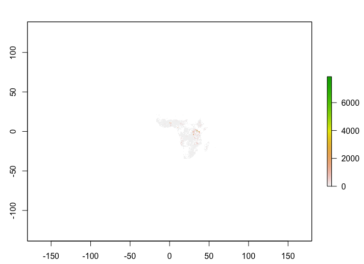

```{r, include = FALSE}
knitr::opts_chunk$set(
  collapse = TRUE,
  comment = "#>"
)
```

This is a basic example which shows you how to run sensitivity analysis on pre-loaded parameters.As a pre-requisite, install package using

```{r eval=FALSE}
devtools::install_github("GarrettLab/CroplandConnectivity", subdir = "geohabnet",
auth_token = "your PAT")
```

Package offers 2 ways to use custom raster file - using `parameters.yaml` and `sa_onrasters` which is also used internally to create raster object using the provided source.

Loading package

```{r setup eva}
library(geohabnet)
```

```{r eval=FALSE}
get_parameters()
```

Set the `file` parameter under `Hosts` to the absolute path of `raster` file -

```         
Hosts:
      monfreda: ["avocado"]
      mapspam:
      file: "full-path-to-tif/avocado_HarvestedAreaFraction.tif"
```

Feed the updated parameters to package -

```{r eval=FALSE}
set_parameters("parameters.yaml")
```

Raster files ends with extension `.tif`. Since, the internal workflow only uses harvested fractional area of a cropland, we recommend using raster files as specified in this [dataset](https://gdcc.github.io/dataverse-previewers/previewers/betatest/ZipPreview.html?fileid=3985008&siteUrl=https://dataverse.harvard.edu&datasetid=3332710&datasetversion=4.0&locale=en). For this particular example, we will use `spam2017V2r1_SSA_H_BEAN_A.tif` from the **monfreda**.

```{r eval=FALSE}
# Generate raster object
# replace the tif file with actual path after download
rr <- get_crop_raster_fromtif("spam2017V2r1_SSA_H_BEAN_A.tif")
rr
```
```
class      : RasterLayer
dimensions : 2160, 4320, 9331200  (nrow, ncol, ncell)
resolution : 0.083333, 0.083333  (x, y)
extent     : -180, 179.9986, -89.99928, 90  (xmin, xmax, ymin, ymax)
crs        : +proj=longlat +datum=WGS84 +no_defs
source     : spam2017V2r1_SSA_H_BEAN_A.tif
names      : spam2017V2r1_SSA_H_BEAN_A
```
To ensure we have the correct raster,

```{r eval=FALSE}
terra::plot(rr)
```

{width="408"}

Next, once you have all the values ready, run risk analysis with `geohabnet::sa_onrasters()`

```{r eval=FALSE}
geohabnet::sa_onrasters(cropharvest_raster = rr,
                        geo_scales = list(c(-50, 50, -50, 50)),
                        link_thresholds = c(0),
                        host_density_thresholds = c(0.0000015),
                        resolution = 24)
```

On successful analysis, function will produce output maps. See example below.

{width="351"}

If the extent is incorrect and no valid cells can be discovered based threshold, then analysis will be interrupted and error will be thrown - \color{red}

```         
Error in .extract_cropland_density(the$cropharvest_aggtm_crop, host_density_threshold) : 
  host density threshold:  0.00015  is greater than the max value:  -Inf  of aggregate raster
```
