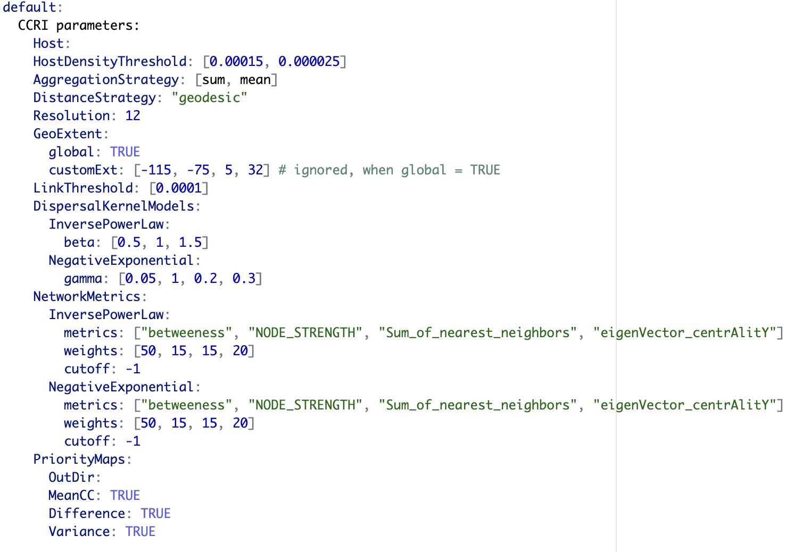

```{r, include = FALSE}
knitr::opts_chunk$set(
  collapse = TRUE,
  comment = "#>"
)
```

# Abstract

Habitat connectivity can be used to analyse the potential spread of plant pathogen, pest, or any habitat-dependent species. Habitat connectivity of a species depends on the habitat availability (e.g., host availability for plant pests or pollinators or availability of favorable climate for plant species), and probability of movement of a species between habitat locations. In geohabnet, habitat connectivity indicates the importance of a habitat location in facilitating the spread of a species across a geographic region, relative to other locations in the same landscape. For plant pathogens and pests, the spatial distribution of host availability plays a crucial role for defining habitat availability and the establishment of the pest species. Locations with abundant habitats (e.g., plant hosts) may play a minor role in species spread if they are isolated. Yet, a location with limited habitat may play a major role in the spread of a species if it acts as a bridge between regions that would otherwise be separated. [@geohabnet] provides the R-user community with a network-based approach to estimate habitat connectivity across the world. This package supports up to 10 parameters that has potential to influence habitat or landscape connectivity. The implementation of [@geohabnet] expands the cropland connectivity method for plant pathogens proposed by [@xing2020] to a general way of calculating habitat connectivity for any species. The network-based framework for [@geohabnet] is the same as the one proposed by [@xing2020]. However, [@geohabnet] provides more flexibility to users to modify any parameter values in this framework.

Although this article focuses on the use of [@geohabnet], it is useful to know for interested developers that package design is inspired from widely used Configuration-based design in software development [@sre_book], [@nash2009]; and [@config] provides a text based interface to control the parameters values for risk analysis in this context.

The primary objective of this vignette is to help user being familiarized with [@geohabnet], list its capabilities and get an intuition behind them. It also describes the implementation of the main functions in [@geohabnet] to support this intuition. Throughout the article, we will be citing external sites and resources, which are relevant for the use of this package.

# Pre-requisites

## Definitions

-   Raster - Raster is a digital encoding representation of geographic information as a grid of cells or pixels, where each cell contains a value representing a specific property or attribute of a location. Some details of a raster data include spatial resolution, dimensions, or geographic extent, which are useful in identification and processing. Here, we use raster to represent maps.

-   TIFF(Tag Image File Format) is a type of file that stores geographic information in the form of raster. [@geohabnet] has been tested using .tif and .nc files but it would be able to handle any raster type of file supported by the R package terra.

## External materials

-   Download and install R, R Studio - [https://rstudio-education.github.io/hopr/starting.html/](https://rstudio-education.github.io/hopr/starting.html){.uri}

-   Raster - <https://www.adobe.com/creativecloud/file-types/image/raster.html>

-   TIFF - [https://www.adobe.com/creativecloud/file-types/image/raster/tiff-file.html/](https://www.adobe.com/creativecloud/file-types/image/raster/tiff-file.html){.uri}

## Data sets

For estimating habitat connectivity for understanding the spread of plant pathogens or pests, we use cropland density or host availability around the world as a proxy for habitat availability (this assumption can be complemented with species-specific environmental suitability for a better proxy of habitat availability). We use publicly available sources to obtain crop distribution in the form of raster layers.

-   [CROPGRIDS](https://doi.org/10.6084/m9.figshare.22491997) [@Tang2024]

-   [EARTHSTAT](http://www.earthstat.org/harvested-area-yield-175-crops/) [@monfreda2008]

-   [MapSpam (2010, 2017)](https://dataverse.harvard.edu/dataset.xhtml?persistentId=doi:10.7910/DVN/PRFF8V) [@internationalfoodpolicyresearchinstitute2019]

-   [CroplandCROS](https://croplandcros.scinet.usda.gov/) [@USDA]

-   [GBIF](https://www.gbif.org/) [@GBIF]

geodata provides a set of APIs to access the EARTHSTAT and MapSPAM datasets directly in R (see code below).

The raster layers from the data sources listed above may need some transformation before using them in [@geohabnet]. A valid raster layer to be used in geohabnet is one that its entry values of each pixel range from 0 (no habitat available) to 1 (habitat is available in the entirety of the pixel). For example, data layers of cropland fraction from EARTHSTAT can be directly provided to [@geohabnet] functions without the need to re-scale its entries. However, data layers of harvested area from CROPGRIDS will need re-scaling the values of each grid cell in the raster (see an example of how to do this below).

For visualization and plots, [@geohabnet] uses [rnaturalearth](https://docs.ropensci.org/rnaturalearth/).

# Quick Start

## Meta information

-   Package information - <https://garrettlab.github.io/HabitatConnectivity/>
-   CRAN site - <https://CRAN.R-project.org/package=geohabnet>
-   Source code - <https://github.com/GarrettLab/HabitatConnectivity/tree/main/geohabnet/>
-   Report issues - [https://github.com/GarrettLab/CroplandConnectivity/issues/](https://github.com/GarrettLab/HabitatConnectivity/issues/){.uri}
-   Garrett lab website - <https://www.garrettlab.com/>

## Installation and loading

Installing `geohabnet` will automatically install its dependencies on other R packages. See the list of dependencies using `desc::desc(package = "geohabnet")`

```{r eval = FALSE}
if (!require("devtools")) {
  install.packages("devtools")
}
```

```{r cran, eval=FALSE}

if (!require("geohabnet")) {
  utils::install.packages("geohabnet")
}
```

Alternatively, you can install the development version of `geohabnet` from GitHub repository.

```{r github}
library("devtools")

if (!require("geohabnet")) {
  install_github("GarrettLab/HabitatConnectivity", subdir = "geohabnet")
}
```

Either way, now you can load `geohabnet` in R as follows:

```{r message=FALSE}
library(geohabnet)
```

At any point, you can access the help page using the following

```{r message=FALSE}
?geohabnet # For description of the package
# and
?geohabnet::msean # For documentation of a function (in this case, the msean function)
```

## Habitat connectivity analysis based on default parameters

The section below illustrate how the habitat connectivity analysis can be conducted using the default set of values for the supported parameters. For this example, we use the raster layer for avocado harvested area from CROPGRIDS as a real-world case study for the habitat connectivity of avocado-specific pathogens. This example would run the analysis on global geographical extent relatively quickly since the crop presence around the world is relatively low.

For the purposes of demonstration, the code below sets the host parameter programatically or directly in RStudio. Alternatively, the parameters can be fed via `parameters.yaml` in an interactive way using either the path or setting `iwindow = TRUE` for the windows prompt in `set_parameters()`

## Running your first habitat connectivity analysis

If you are also replicating this example, please first download the avocado layer from CROPGRIDS and put it in the folder you are currently working. Note that we are downloading the raster layer for host availability (or habitat availability) manually from CROPGRIDS. However, an alternative option is getting the data layer directly in RStudio using the `geodata` package (depending on whether it is down or not). At the time, we created this vignette `geodata` was not working on our local machine but the R code to do so is provided.

```{r av_download}
#if (!require(geodata))
#  install.packages("geodata")
#avocado_sp <- geodata::crop_monfreda(crop = "avocado", var = "area_ha", path = tools::R_user_dir("geohabnet", which = "config"))

library(terra)

avocado_rast_input <- system.file("extdata/CROPGRIDSv1.08_avocado.nc", package = "geohabnet", mustWork = TRUE)
avocado_sp<-rast(avocado_rast_input)
cell.area <- (0.05*111111)*(0.05*111111) /10000 #area in heactares
avocado_sp<-avocado_sp$harvarea / cell.area #area in hectares

values(avocado_sp)<-ifelse(values(avocado_sp) > 0,
                           values(avocado_sp), NaN)
avocado_sp<-aggregate(avocado_sp, fact=2, fun="mean", na.rm=TRUE)
writeRaster(avocado_sp, tempfile(pattern = "avocado_density", fileext = ".tif"), overwrite=TRUE)
```

Note that, apart from getting the raster in R, we are also scaling the entry values of each grid cell in the raster layer, from harvested area in hectares to avocado cropland fraction. We are aggregating this raster layer to reduce computational cost when running the analysis (for illustrative purposes only, you may not need to do this for your own data set). We are also saving the new avocado area fraction as a new raster layer in our local machines.

### Setting values in a function

Now let's visualize how the avocado area fraction looks like. The internal implementation and program deals with object of `terra` [@terra] and `igraph`[@igraph] . The primary object is of type `SpatRaster` from `terra`.

In the example below, we will use the same spatial raster obtained for avocado. First, it shows the properties of the raster layer, which we will learn about them below. [gplot()] quickly shows the content of raster layer.

```{r message=FALSE}
avocado_sp
gplot(avocado_sp)
```

Now that we have a raster object in R, this raster layer can be used as the input in the `msean` function (one of the main functions of `geohabnet`) to produce your first habitat connectivity analysis. In this case, we are providing input for the always-required parameter - *rast* and keeping the default values for the other parameters supported by this function (for now). Running the example below usually takes 5-10 minutes depending on the processing power of your machine.

```{r message=FALSE}
geo_net <- msean(avocado_sp)
```

Many, many congratulations! You have just generated a full sensitivity analysis of habitat connectivity for avocado-specific pathogens and pests. Take a minute to appreciate the beauty of our three outcome maps: the map of mean habitat connectivity, the map of variance habitat connectivity, and the map of the difference between them.

Now let's dive a little bit on the nitty-gritty details. The function `msean` is very similar to `sean` except that `msean()` is able to produce the maps above. They also return different S4 objects: a `GeoNetwork` object is produced by `msean`, while `sean` produces a `GeoRasters` object. The results should be interpreted in accordance to the values of other parameters that have factored as arguments to `sean`. Run ?sean to see all the supported parameters. For now, let's focus on some parameters you might want to change.

1.  *rast* - *spatRaster*. Represents the map of habitat availability in a geographical area. In our example above, this is `avocado_sp`, the unique parameter that was provided to `msean`.

2.  *geoscale* - *Vector*. Refers to the geographical coordinates in the form of c(Xmin, Xmax, Ymin, Ymax).

3.  *global* - *Logical*. When set as TRUE, *geoscale* is ignored.

    -   You can get the geographical scales used in a global habitat connectivity analysis (like the one above) by running

        ```{r}
        global_scales()
        ```

    -   It is not highly recommended to change the default value for global scales used for a global connectivity analysis since it has been finalized after several tries. However, if you need to change the global scale for an advanced use, you can set different global geographic scales using the following

        ```{r}
        #set_global_scales(list(east = c(-24, 180, -58, 60), west = c(-140, -34, -58, 60)))
        ```

4.  *thresholds* *- Numeric.* `msean` supports two types of thresholds: *host density* and *link weights* represented by *hd_threshold* and *link_threshold*, respectively*.* The former threshold (host density threshold or habitat availability threshold) excludes from the habitat connectivity analysis all values in aggregated raster layer below this threshold. The latter threshold (link weight threshold) excludes from the habitat connectivity analysis all entry values in the adjacency matrix that are below this threshold. Entries in the adjacency matrix (or link weights in its corresponding network) are the product of habitat availability and the relative likelihood of dispersal between each pair of locations in the selected region.

5.  *resolution* - Numeric. This is a spatial aggregation value. In the context of *SpatRaster*, this parameter is the number of pixels that are aggregated to produce a new finer/coarser version raster data layer. Default is

    ```{r reso}
    reso()
    ```

6.  Outcomes - `msean` calculates, produces, and plots three maps of habitat connectivity in a region, which are the same outcomes produced by `sensitivity_analysis()`(the other main function of `geohabnet`). An alternative is `sean()` which can be called to obtain the results from the function call and has no side effects.

### Using configuration

More parameters are available under configuration and thus more control over the analysis. The configuration file name is `parameters.yaml`, currently supporting up to 10 parameters. The intuition behind this methodology is to provide a basic interface for setting new values. The snippet below describes the basic usage of configuration.

Get the initial configuration file. By default this function will save the file in temporary directory `tempdir()`, however we recommend saving to path where program will have write permissions. Using *iwindow = TRUE* will prompt a selection window to save config file.

```{r}
config_file <- get_parameters(out_path = tempdir())
config_file
```

The file should look something like this -

{width="700"}

The values must be modified without modifying the structure. The order don't matter for the program. The new values in the configuration must be fed to the workflow. For the purposes of demonstration, the code below sets the host parameter programitically. The parameters can be fed via `parameters.yaml` in an interactive way as well using either the path or setting `iwindow = TRUE` for the windows prompt in `set_parameters()`

```{r config_run}

if (!require("geodata"))
{
 install.packages("geodata") 
}

path_to_avo <- system.file("extdata/avocado_density.tif", package = "geohabnet", mustWork = TRUE) #terra::sources(avocado_sp)
params_file <- geohabnet::get_parameters()

if (!require(yaml))
  install.packages("yaml")

params_yaml <- yaml::yaml.load_file(params_file)
params_yaml$default$`CCRI parameters`$Host <- path_to_avo
yaml::write_yaml(params_yaml, params_file)

geohabnet::set_parameters(params_file)
#using iwindow = true will prompt a selection window to choose config file.
```

`get_parameters()` was only to fetch the initial parameters. While you can, it is not required to re-fetch if the parameters has not been modified in the configuration. Modify the value and feed it to workflow using `set_parameters()`.

# Parameters

### Hosts

The library supports a spatial raster file (e.g. TIFF). The case studies were done on crop data from Monfreda[@monfreda2008] and Mapspam[@internationalfoodpolicyresearchinstitute2019] which is available via `geodata` package [@geodata]

```{r message=FALSE}
results <- sensitivity_analysis()
```

### Thresholds

Thresholds are used to select subset of values from the `SpatRaster` on which the operations are applied. It directly effects the connectivity and gives a sense of sensitivity in the network. The intermediate goal is to produce a adjacency graph which essentially determines the connectivity. Cells which doesn't meet the threshold are removed from the consideration by dispersal models.

```{r message=FALSE}
risk_indexes <- msean(avocado_sp, global = FALSE, hd_threshold = 0.0001, link_threshold = 0.001)
```

#### Density Thresholds

host density threshold. The host density threshold is the minimum cropland proportion in the grid cells (or locations) that will be included in the analysis. This parameter is called `HostDensityThreshold` and supports a list of values between 0 and 1. Before running the sensitivity_analysis() function, check that the values for the host density threshold are smaller than the maximum host density in the map to prevent errors. The values are rounded off to 5 decimal points.

#### Link Thresholds

Based on the information on host distribution and dispersal kernels, adjacency matrices are created, where entries are the likelihood of pathogen movement between locations. Then, adjacency matrices are converted into graph objects to perform a network analysis, where the entries in the adjacency matrices now are the weight of the links of the network.

Choosing link weight thresholds helps to focus the analysis on the more likely pathogen dispersal in the landscape.

Like what you did with the host density threshold, you can provide a list of positive values to `LinkThreshold`. Before running the sensitivity_analysis() function, check that the values for the link weight threshold are smaller than the maximum link weight in the network to prevent errors.

### Aggregation

Aggregation strategy refers to the function used to create a new map of host density with a lower resolution (larger cells). Reducing the spatial resolution helps to reduce the computational power needed to run the analysis.

-   If AggregationStrategy: [sum], then the sum of the cropland proportion of all initially small grids within a large grid is divided by the total number of initially small grids within that large grid.

-   If AggregationStrategy: [mean], then the sum of the cropland proportion of all initially small grids within a large grid is divided by the total number of initially small grids containing only land (where small grids with water are excluded) within that large grid.

By default, analysis is run on both but can be opted out from one. If only one method is used, then the difference map is skipped from the outcome.

### Distance methods

For each pair of locations in the host map with values greater than the host density threshold, the sensitivity_analysis() function will calculate the physical distances and use them to calculate the relative likelihood of pathogen movement between locations based on their pairwise geographical proximity.

There are two different options to calculate the distance between locations.

· Vincenty ellipsoid distance

This option is highly accurate but more computationally expensive.

· Geodesic distance

This option is less computationally expensive and less accurate than the option above.

You can set the distance option either as *DistanceStrategy: "vincentyEllipsoid"* or *DistanceStrategy: "geodesic"*. One of these options should be used as input to run the analysis. Check for supported methods in analysis by running `dist_methods()` in the console.

```{r}
dist_methods()
```

### Resolution

The aggregation factor or granularity is the number of small grid cells that are aggregated into larger grid cells in each direction (horizontally and vertically). The finest value is 1 which can require analysis to run up to hours because of large number of cells in `SpatRaster` . The resolution is also used in calculation of variance while dis-aggregating the risk indices into coarser resolution for producing maps.

If not provided, the defaulted value is selected from `reso()`

### Metrics

See available metrics using

```{r}
supported_metrics()
```

Metrics corresponding to dispersal models are applied to distance matrix with specified weights. The weights must be specified in % and sum of all the weights should be equal to 100. We use functions from [@igraph] to calculate metrics for each dispersal model. The 2 dispersal models that are applied to parameters *inverse power law* and *negative exponential*. More formally, metrics are way to determine connectivity among nodes in a network.

In a graph functions of [@igraph], the links are interpreted as distances. However, in the context of habitat connectivity, the network is adapted to interpret links as weights which means that the likelihood of pathogen spread is lower if the distance is larger.$$
L = \frac{1}{W}, \\
W' = \sum_{i=1}^{N} \max(W - W_i)
$$

L is link weights and W is the original weights in an undirected graph. W' is the transformed weight vector for calculating network centrality.

### Geographical Extent

Geographical extent is a subset of world map defined by coordinate reference system. The corresponding parameter to set the area in `sean()` and `sensitivity_analyis()` is `geoscale` and `GeoExtent` respectively. Default setting is `global = TRUE` which will ignore the value of `geoscale`. This will consider taking the world map into account using values from `global_scales()` . For non-global analysis, either set `global = FALSE` with or without the setting `geoscale`. By default, `geoscale` will be extracted from the extents from the input SpatRaster. We recommend using EPSG:4326 as coordinate reference system because the functions have been tested on it.

1.  Using function

    ```{r non-global, message=FALSE}
    results <- msean(avocado_sp, global = FALSE, geoscale = c(-115, -75, 5, 32))
    ```

2.  Using config

    Set `Global = FALSE` and `CustomExt = [-115, -75, 5, 32]` . The initial `parameters.yaml` already contains this value which would run in combination with other parameters.

When provided with `geoscale`, program will take the subset of provided raster (data-set of a crop). The workflow will apply graph operations and network connectivity only to the subset.

# Outputs

By default, 3 maps are produced for each analysis. `sean()` also returns risk indices without maps which can, then be fed to `connectivity()` . This flexibility is supposed to allow users to use the risk indices for their purposes or use our function to produce maps with further different parameters.

In a code below, after obtaining results, the maps are produced. In order to calculate variance, cells of `SpatRaster` are extended to coarser value using `res` parameter. Setting `maps = FALSE` will suppress the calculation of outputs.

`sean(avocado)` + `.connectivity(georast)` is equivalent to `sensitivity_analysis()` or `msean()` which produces maps as side effect. The user function equivalent is connectivity() which accepts primitives types instead of S4 class.

```{r final}
final <- msean(avocado_sp, link_threshold = 0.0001, hd_threshold = 0.0025)

# checkout the type of an object
class(final)
```

Based on the result obtained from last cell, let's navigate the object final object. You would have noticed the maps as a side effect and that's really the whole point. See the result summary by simply calling the `final` object and navigate using the standard S4 classes approach.

```{r see}
final
```

The final operations are performed risk indices and on the 3 results that are produced -

1.  Mean

    A mean of all the `SpatRasters` resulting from combination of parameter values. The values in cells are added across all the indices and divided by number of indices. It represents the connectivity based on host density in the given area.

    Navigating the resulting object -

    ```{r mean, eval = FALSE}
    gplot(final@me_rast)
    ```

2.  Variance

    Uses `stats::var` on risk indices, subset is extracted for provided scale and finally pixels are dis-aggregated using *factor = resolution value in original parameter* to from previous step.

    ```{r var, eval = FALSE}
    gplot(final@var_rast)
    ```

3.  Difference

    If both the aggregation methods (*sum and mean*) is selected, then difference is calculated between the rank of matrices which are essentially numeric cells of risk indices of type *SpatRaster*. The result is dis-aggregated in the same way as previous step.

    ```{r diff}
    gplot(final@diff_rast)
    ```

The path to saved raster can be accessed using the 'type_out' slot. Additionally, access the risk indices and it's corresponding adjacency are further accessible within slots in the `GeoNetwork` class.

```{r geonet}

# checkout the results
final@rasters

# global is TRUE because we original set the global analysis
# thus, we will have set of 2 risk indices, eastern and wetern hemisphere
final@rasters$global_rast

# Number of elements from above determines the the number of parameter values provided

# To access the adjacency matrix,
final@rasters$global_rast[[1]]$east[[1]] # this is also s4 class 'GeoModel'
```

Checkout the adjacency matrices by running the code below -

```{r adm}

# replace the indexing with any arbitary index,
# uncomment line below to see the results.

#final@rasters$global_rast[[1]]$east[[1]]$amatrix
```

Set *pmean, pvar, pdiff* to *FALSE* to skip the any of the calculation in `connectivity()` to skip this calculation. In `sean()` or `sensitivity_analysis()`, set `map = FALSE` to skip the generation of maps as an outcome. In case of global analysis, result of eastern and western geographic extents are merged using `terra::merge()` . The outcome of each of the operation are saved in the new directory *plots* under the specified path in `OutDir` with name *opt_datetime.tif*, where *opt* is one of the above suffixed by datetime of the file created. If the `outdir` is empty, the value is defaulted to `tempdir()` . This applies to corresponding parameter `outdir` in all the functions.

# Computing

To understand the motivation behind implementation, let's analyze the complexity. Since link and host density threshold is a list, let the size be N. For the kernel models, let's represent metrics and dispersal coefficients as x and 4 reprectively. The overall complexity turns out to be $N \cdot N \cdot (7X + 7Y)$ . Here, we have assumed the availability of host density. Although, the crop data is fetched in parallel to minimize the download time. Considering $X = max(X, Y)$ , the complexity will now be $T = 7N^2 X^2 \approx 7N^4$. We discount the complexity of graph operations like those of centrality scores because we haven't attempted to optimize these operations. We try to optimize the performance through scaling which is fixed problem size, but increasing parallelism.

The operations are compute intensive. The `run_msean` snippet under [Hosts] used up to 8.3GB of memory which was 81% of the memory allotted to RStudio. For the most part, the implementation has focused on performance over efficient memory usage.

This Package applies mechanisms such as vectorization and foreach to improve the performance and efficiency. The workflow has several parts running independently. There are independent functions which performs operations such adjacency matrix and or aggregation. This created an opportunity for task level parallelism in running functions within geohabnet. Each combination of parameters can be run independently and in parallel through most of the parts using future mechanism. The implementation supports workflow acceleration using [@future.apply; @future] . It is also important to note that we use SpatRaster object throughout the computation. SpatRaster is an external pointer in C++ rather than an R object and thus adds overhead of conversion, neutralizing the performance gains.

```{r fut, eval = FALSE}
#avocado <- geohabnet::cropharvest_rast("avocado", "monfreda")

# see ?future::plan for details
future::plan(future::multicore())
msean(avocado_sp)

future::plan(future::multisession())
msean(avocado_sp)
```

# References
