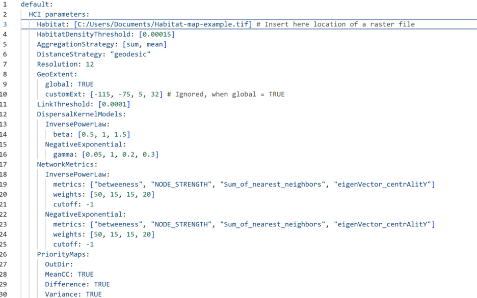
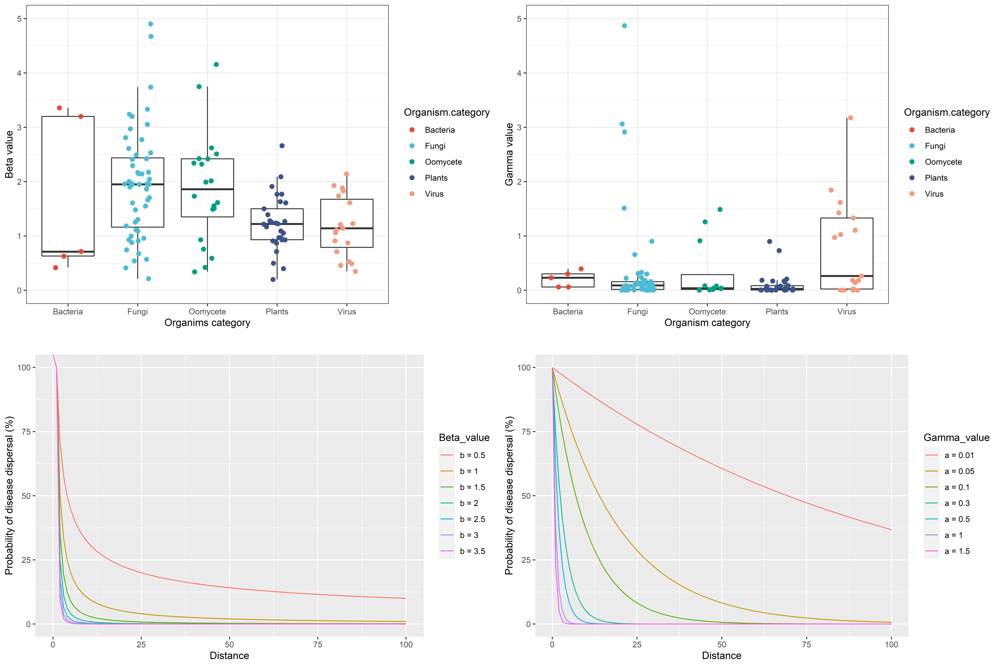

```{r, include = FALSE}
knitr::opts_chunk$set(
  collapse = TRUE,
  comment = "#>"
)
```

Welcome to the user guide for geohabnet [@geohabnet-2], an R package for the analysis of habitat landscape connectivity!

This section is designed for users already familiar with R and RStudio. While RStudio is considered an interactive environment, using R from the CLI is not. The pre-print for this application paper can be accessed [here](https://arxiv.org/abs/2510.24955) [@geohabnet-2].

The underlying theory for calculating habitat connectivity is based on network analysis. To get an idea of the concepts of habitat connectivity in `geohabnet`, users are recommended to check Xing et al[@xing2020] – Global cropland connectivity: A risk factor for invasion and saturation by emerging pathogens and pests.

# Installation and pre-requisites

The `geohabnet` R package can be directly installed and loaded in RStudio using the following commands.

Note that it is strongly recommended to have R 4.5.1 as the minimum version of R to successfully install `geohabnet`.

For the stable version published in CRAN:

```{r eval=FALSE}
install.packages("geohabnet")
```

This version 2.3 is available in [CRAN](https://cran.r-project.org/web/packages/geohabnet/index.html)

For the latest development version available on GitHub:

```{r eval=FALSE}
install.packages("devtools")
devtools::install_github("GarrettLab/CroplandConnectivity", subdir = "geohabnet")
```

This version is available at the [GitHub repository](https://github.com/GarrettLab/HabitatConnectivity)

In either case, the user will be prompted to update dependencies to other R packages during the installation in RStudio. We recommend updating all the package dependencies. The dependencies of the `geohabnet` package and their minimum versions required can be accessed by the following code:

```{r eval=FALSE}
desc::desc(package = "geohabnet")
```

Note that `desc::desc()` is a function from an external package and requires installation for its use. Now, the `geohabnet` package can be loaded into the current R environment.

```{r eval=FALSE}
library(geohabnet)
```

# Getting started

The landing page and documentation can be accessed using `?geohabnet`. This guide was written for `geohabnet 2.3`, which is available for download in CRAN and GitHub.

The help page for all the functions can be accessed with `?geohabnet::fun` or `help(geohabnet::fun)`, where fun needs to be changed to the name of a function of your interest. For example, `?geohabnet::msean()` or simply `?msean` will provide documentation for the function `msean()`.

`geohabnet 2.3` provides two main functions to estimate and map the connectivity of locations where habitat is present (hereafter, habitat connectivity): `sensitivity_analysis()` and `msean()`. The package also offers supplementary functions, but they are not covered in this user guide. Before running the main functions, please review the description of each parameter below.

Well, there are over ten parameters that can be used in either `sensitivity_analysis()` or `msean()`. The parameters in `msean()` can be modified directly within the function in RStudio, as is common in many R packages. `sensitivity_analysis()` requires a list of parameters, providing an organized way to easily change the default parameter values without listing them every time. The list of parameters for `sensitivity_analysis()` is called *parameters.yaml*.

The following steps allow you to access the *parameters.yaml* file, specify parameter values, and use them for analysis in `sensitivity_analysis()`:

1.  You can get the *parameters.yaml* file by running `geohabnet::get_parameters()` and specifying the location where the file will be saved. Use `iwindow = TRUE` for interactive selection or provide an absolute file path to the parameter out_path for non-interactive use. For example, Plex ran the following:

```{r eval=FALSE}
get_parameters(out_path = "C:/Users/plexaaron/Documents")
```

2.  Open the *parameters.yaml* file in any program that allows you to edit it (outside RStudio). Please do not alter the structure of the yaml file and parameter names to ensure it will be successfully compatible with `sensitivity_analysis()`. Except for Habitat, this file will contain default acceptable values for the supported parameters (see picture below).

3.  Manually modify or add values in the *parameters.yaml* file and save it.

4.  Feed the new *parameters.yaml* file to the package using `geohabnet::set_parameters()` which will return TRUE if the parameters were set successfully. For example, Plex ran the following:

```{r eval=FALSE}
set_parameters(new_params = "C:/Users/plexaaron/Documents/*parameters.yaml")
```

5.  Now you can run `sensitivity_analysis()` to produce maps of habitat connectivity.



**Figure 1.** Initial parameter values in the *parameters.yaml* file for `sensitivity_analysis()`.

# Setting parameters in sensitivity_analysis() and msean()

## 1. Providing habitat distribution

Users can provide any type of habitat map that is compatible with the `terra:rast()` function. Typically, this is a TIFF file in the standard geographic coordinate system (WGS84). Acceptable entries in this `SpatRaster` range from zero (no habitat is available in a location) to one (the location is fully covered with habitat for a species).

Host availability is an important component of habitat quality for plant pathogens. Here, we provide two ways for providing maps of host availability for `geohabnet`. The first one is intended for using your data, and the latter is based on data sources for the global distribution of crop hosts.

-   **Your own data**. The `geohabnet` package is designed to accept raster files as inputs for the distribution of habitat availability. You can provide your raster file in two ways:

To use `sensitivity_analysis()`, you can specify the absolute path or location of your raster file in the *parameters.yaml* under `Habitat` (see example in the figure above).

To use `msean()`, the user is required to read the habitat map directly in R. For example:

```{r eval=FALSE}
hab.rast <- terra::rast("habitat-map-example.tif")
```

-   **Monfreda Dataset[@monfreda2008]**. Monfreda et al. (2008) provides information for the geographic distribution of 172 crop categories. These maps can be used as a first approximation for the habitat quality of plant pests or pollinators.

You can access this dataset directly in R using the `geodata` package. Run `geodata::monfredaCrops()` in your console to check which crops are available in the Monfreda dataset. You can use a SpatRaster of the crop of interest in `geohabnet` with the following code:

```{r eval=FALSE}
library(geodata)
hab.rast <- crop_monfreda(crop = "banana", var = "area_f", path = tempdir())
library(geohabnet)
msean(rast = hab.rast)
```

Alternatively, you can access the Monfreda dataset by downloading crop distribution maps from [EarthStat](http://www.earthstat.org/). You can then provide the location of the downloaded TIFF file in the *parameters.yaml* file when using `sensitivity_analysis()`. Note that an updated version of the Monfreda dataset is the [@Tang2024], though data layers need to be transformed from harvested area to cropland fraction.

-   **MAPSPAM dataset**. This dataset provides information for the global distribution of 42 crops or crop groups (IFPRI 2019). You may want to use the harvested area or physical area for your analysis of habitat connectivity in `geohabnet`:

You can access this dataset in R using the `geodata` package. Run `geodata::spamCrops()` in your console to check which crops are available in the MAPSPAM dataset. You can use a SpatRaster of the crop of interest in `geohabnet` with the following code:

```{r eval=FALSE}
library(geodata)
library(terra)
hab.rast <- crop_spam(crop = "banana", var = "phys_area", path = tempdir())
conv.factor <- res(hab.rast)[1]*111000 * res(hab.rast)[1]*111000 / 10000
hab.rast <- hab.rast$banana_phys_area_all / conv.factor
library(geohabnet)
msean(rast = hab.rast, res = 24)
```

Note that we convert the physical area of crop availability in hectares to the fraction of total area occupied by the crop. The `conv.factor` estimates the total area of each grid cell in hectares.

Alternatively, you can access the MAPSPAM dataset by downloading crop distribution maps from [MAPSPAM](https://www.mapspam.info/). Note that newer versions of MAPSPAM are not available in the `geodata` package, as of October 10, 2025.

-   **Other data sources**. High resolution data layers for crops in the United States are available at [CroplandCROS](https://croplandcros.scinet.usda.gov/) [@USDA]. Maps of wild host species may be constructed from geographic occurrences in the Global Biodiversity Information Facility (GBIF[@GBIF], <https://www.gbif.org/>).

-   **Other choices**. You may prefer that your analysis be based on both the Monfreda[@monfreda2008] and MAPSPAM datasets. In this case, you may first get a spatRaster with host density for the target crop category from each dataset and then average them to generate a `SpatRaster` of the mean host availability. Another situation is that you need to add different crop categories into a `SpatRaster` because the habitat of a species ranges across multiple crop species.

## 2. Selecting habitat threshold

Now that you have selected the habitat landscape for your analysis, the next step is to set a threshold for habitat availability. The habitat threshold is the minimum proportion of habitat available in the grid cells (or locations) that will be included in the analysis. Choosing a habitat threshold is useful when the user needs to focus the connectivity analysis on more important locations in the landscape, reducing the computational expense needed to run the analysis. Likewise, some species might require an minimum level of habitat availability for movement.

In `geohabnet`, this parameter is called `HabitatThreshold` and can support any values between 0 and 1. Note that a sensitivity analysis can be conducted by specifying a list of values for the habitat threshold. To prevent errors, ensure that the values for the habitat threshold are less than the maximum value of habitat availability on the map you provided.

## 3. Selecting a spatial aggregation strategy

Aggregation strategy refers to the function used to create a new map of habitat availability with a lower resolution (larger cells). Reducing the spatial resolution reduces the computational power needed to run the habitat connectivity analysis. It also helps evaluate how habitat connectivity changes from fine to coarse resolution.

In `geohabnet`, there are two aggregation strategies:

-   If `AggregationStrategy: [sum]`, then the sum of the habitat availability of a set of small grid cells is divided by the total number of small cells within the resulting larger grid.

-   If `AggregationStrategy: [mean]`, then the sum of the habitat availability of a set of small grid cells is divided by the number of small cells containing only land within the large grid. In this strategy, small cells with water are excluded from spatial aggregation.

## 4. Selecting spatial resolution

In `geohabnet`, the aggregation factor or granularity is the number of small grid cells that are aggregated into larger grid cells in each direction (horizontally and vertically). For example, the finest spatial resolution of the MAPSPAM and Monfreda[@monfreda2008] datasets is 5 minutes, and a granularity value of 6 will result in maps with a spatial resolution of 0.5 degrees. Table 1 compares the spatial resolution and sizes of grid cells for different values of granularity that can be used to aggregate the maps from the MAPSPAM or Monfreda[@monfreda2008].

**Table 1.** Spatial resolutions and their corresponding granularity.

| Spatial resolution (degree) | Spatial resolution (minutes) | Grid size (km²) | Grid area (km²) | Granularity |
|---------------|---------------|---------------|---------------|---------------|
| 1° | 60 mins × 60 mins | 111 × 111 km² | 12,394 km² | 12 |
| 0.5° | 30 mins × 30 mins | 55.7 × 55.7 km² | 3,102 km² | 6 |
| 0.25° | 15 mins × 15 mins | 27.8 × 27.8 km² | 772 km² | 3 |
| 0.1667° | 10 mins × 10 mins | 18.5 × 18.5 km² | 342 km² | 2 |
| 0.0833° | 5 mins × 5 mins | 9.27 × 9.27 km² | 85 km² | 1 |

You can choose the spatial resolution of the analysis using the `Resolution` parameter, which currently supports a single integer value of 1 or greater.

-   If you want to check which spatial resolution is being used in the analysis, run `reso()` in the console.

-   Setting the spatial resolution directly in *parameters.yaml* file is recommended.

Analysis at finer (higher) spatial resolution can be more computationally expensive. For example, using a 6 CPU machine, a global analysis of host connectivity at one-degree resolution for coffee croplands can last 20-30 minutes, and for wheat croplands, more than two hours.

## 5. Selecting strategy for the calculation of geographic distance

For each pair of locations in the habitat map with values greater than the habitat threshold, the `sensitivity_analysis()` function will calculate the physical distances and use them to calculate the probability of species movement between locations based on their pairwise geographical proximity. Section 7 provides information about the functions used to calculate dispersal probabilities.

There are two options to calculate the physical distance between locations.

-   **Vincenty ellipsoid distance**. This option is highly accurate but more computationally expensive.
-   **Geodesic distance**. This option is less computationally expensive and less accurate for large distances than the option above.

You can set the distance option either as DistanceStrategy: “vincentyEllipsoid” or "geodesic". One of these options should be used as input to run the analysis.

You can check supported methods in analysis by running dist_methods() in the console.

## 6. Selecting geographic extent

The geographic extent refers to the rectangular area for analysis where there is (obviously) at least one grid cell with a habitat available. The geographic extent must be specified with four values representing the geographic limits of the area for analysis, following the order: minimum longitude, maximum longitude, minimum latitude, and maximum latitude. The geographic extent in `geohabnet` is specified in degrees, which are in decimal notation and have a negative sign for the southern and western hemispheres.

In *parameters.yaml*, two options are available to set the geographic extent of the analysis with the parameter `GeoExtent`.

-   If you want to execute your analysis on a global extent, then you set `global: TRUE`.

    -   If you want to check what the global extent coordinates are, run `global_scales()` in the console.
    -   If you want to change the default coordinates of the global extent, you can use the function `set_global_scales()`.
    -   The default coordinates for the global geographical extent cannot be set using the *parameters.yaml*.

-   If you want to run an analysis where the geographic extent is a continent, a country, or any other geographic extent smaller than a continent, then you can use the option `customExt` under `GeoExtent`. Please do not forget to set `global: FALSE`. Otherwise, if `global = TRUE`, then `customExt` is ignored.

## 7. Selecting a dispersal kernel model

Two dispersal kernel models are used to calculate the “relative likelihood” of species movement between locations. These dispersal kernels are also commonly used in movement ecology.

In *`parameters.yaml`*, set any of the following options under `DispersalKernelModels`:

-   If you are interested in the inverse power law model, then set the dispersal parameter beta to any positive decimal value.
-   If you are interested in the negative exponential model, then set the dispersal parameter gamma to any positive decimal value.
-   You can use both dispersal kernel models and evaluate multiple dispersal parameter values in each model simultaneously in the analysis.

Now you may be wondering or panicking about two questions. No worries, we gotcha.

-   First, which dispersal kernel model should I use? Tough question… Table 2 provides some characteristics for each dispersal kernel that can help you decide which one to use in the analysis.

-   Second, which values for the dispersal parameters beta and gamma are best? Another tough question… (hahaha) Figure 2 provides an estimation of the dispersal parameters beta and gamma for a variety of plant pests, which can help answer this question:

    -   Smaller dispersal parameter values result in higher probabilities of species dispersal.

    -   The mean parameter beta is 1.72.

    -   The mean parameter gamma is 0.345.

**Table 2.** Characteristics of the two common dispersal kernels for range expansion of species, after [@brown2002].

| Characteristic | Negative exponential model | Inverse power-law model |
|------------------------|------------------------|------------------------|
| *Model* | exp(–γ × distance) | distance\^–β |
| *Dispersal parameter* | Gamma | Beta |
| *The tail of probability distribution* | The dispersal probability distribution “tail” is exponentially bounded. Thus, long-distance dispersal events will be assigned a very low probability of occurrence. | The dispersal probability distribution is “fat-tailed.” Thus, very long-distance dispersal events are assigned a higher probability compared to the negative exponential model. |
| *Rate of epidemic front* | Constant | Accelerating, relative to the initial inoculum |
| *Range expansion of the epidemic* | Steady | Accelerating |

In conclusion, the inverse power law model is often useful to model long-range spread of a species, while the negative exponential model is more useful to assess short-range spread.



**Figure 2.** Beta values estimated from empirical studies (5 bacteria, 47 fungi, 20 oomycete, 29 plants, and 19 viruses) for inverse power law models (top left panel). Comparison of different beta values on the expected disease dispersal along ‘free-scale’ distance (top right panel). Gamma values estimated from empirical studies for negative exponential models (bottom left panel). Comparison of different gamma values on the expected disease dispersal along ‘free-scale’ distance (bottom right panel). Over 127 observations, most parameter values β are in a range of 0.5 and 3.5, mean 1.72, variance 1.25, and mode 0.93. Most parameter values γ are in a range of 0.01 and 0.5, mean 0.345, variance 0.55, and mode 0.015 or 0.06.

## 8. Selecting link weight threshold

Based on the information on habitat distribution and dispersal kernels, adjacency matrices are created, where entries represent the potential of species movement between habitat locations. Then, adjacency matrices are converted into graph objects to perform a network analysis, where the entries in the adjacency matrices are now the weights of the links of the network.

Choosing link weight thresholds helps to focus the analysis on the more likely species dispersal in the landscape.

Just like what you did with the habitat threshold, you can provide a list of positive values to `LinkThreshold` in the *parameters.yaml* file. Before running the `sensitivity_analysis()` function, please check that the values for the link weight threshold are smaller than the maximum link weight in the network to prevent errors.

## 9. Selecting network metrics

In network analysis, there are different perspectives on how to determine which locations in the landscape are relatively more important. In the initial framework proposed by Xing et al. (2020), the cropland connectivity risk index included four different network metrics to evaluate the importance of locations in the landscape.

The `geohabnet` package provides the flexibility for the user to choose among seven different network metrics to calculate the connectivity of locations (Table 3) and to choose how each network metric is weighted in the analysis. You can run the `supported_metrics()` function in the console to check which network metrics are supported by `geohabnet`.

**Table 3.** Network metrics that are available in the `geohabnet` package.

| Network metric | Function in geohabnet | Definition in network analysis | Interpretation in geohabnet |
|:-----------------|:-----------------|:-----------------|:-----------------|
| **Degree** | `degree(crop_dm, we)` | Node degree measures the number of links of a target node. | Node degree measures a node's influence on its neighbors in a habitat network. In other words, nodes with more connections are more likely to both receive and propagate the species to others once they have it. |
| **Node strength** | `node_strength(crop_dm, we)` | Node strength is the sum of link weights of a target node. | Node strength measures the likely inflow or outflow of a species into or out of each neighbor node in a habitat network. |
| **Sum of nearest neighbors** | `nn_sum(crop_dm, we)` | It calculates the average nearest neighbor degree of a given node. | This network metric measures the influence of the nearest neighbors on a target node in a habitat network. |
| **Eigenvector centrality** | `ev(crop_dm, we)` | Eigenvector centrality measures a node’s influence based not only on how many connections it has, but also on how important its neighbors are. A node connected to other highly connected nodes has a higher eigenvector centrality than one connected to less influential nodes. | Eigenvector centrality measures how locations having many neighbors’ neighbors through long paths in the network can facilitate the flow of species spread. A location in a network, for instance, can be important, by this measure, because it connects to lots of locations (even though those locations may be less important in risking themselves) or connects to a few locations at high risk. |
| **Page rank** | `page_rank(crop_dm, we)` | PageRank is a variant of eigenvector centrality originally developed by Google to rank web pages. It measures the probability that a random walker will arrive at a given node, taking into account both the quantity and quality of incoming links and applying a “damping factor” to simulate random jumps. | PageRank can be interpreted in a similar way as eigenvector centrality. |
| **Closeness** | `closeness(crop_dm, we)` | Closeness centrality measures how close a node is to all other nodes in the network. It is based on the inverse of the average shortest path distance from the node to every other node. | Closeness centrality indicates (i) the relative importance that the spread of a species in a node access or reaches every other node in the host network or (ii) how easily a species from a targeted location can invade every other location in the habitat landscape. |
| **Betweenness** | `betweenness(crop_dm, we)` | Vertex betweenness quantifies how often a target node lies on the shortest paths between other pairs of nodes in a network. | Betweenness centrality emphasizes the importance of a node acting as a bridge by connecting parts of the network that otherwise be separate. Paths with more weighted links (that is, ‘shortest paths’) imply fast species movement between different regions of the network. |

One or more of the supported metrics should be specified in the parameter `NetworkMetrics` for each dispersal kernel model used in the analysis. The user should assign a `weight` to each network metric (in percentage), and the sum of the weights should equal 100. Figure 1 shows an example in which the user selected four network metrics for each dispersal model in the analysis.

Note that naming the network metrics is uppercase/lowercase insensitive.

The `geohabnet` package also provides the user with a function for each network metric as listed in Table 3. Each network metric function can work independently if they are provided with an adjacency matrix.

## 10. Selecting output maps

The `sensitivity_analysis()` function provides three outcomes in two ways.

-   First, the `sensitivity_analysis()` function will generate three maps in the plot panel of RStudio.

    -   A map of the mean habitat connectivity across the selected parameters.

    -   A map of the variance in habitat connectivity across outcomes basing the analysis on the parameters provided in the function.

    -   A map of the difference in ranks between mean habitat connectivity and habitat availability.

By default, all the maps will be produced. Users can choose to see a specific map by setting the parameters under `PriorityMaps` to `TRUE` or FALSE.

If the value above is set to `TRUE`, the outcomes will be calculated internally, and plots will be generated.

-   Second, the `sensitivity_analysis()` function will automatically save the map of outcomes selected by the user in the current directory. The name of the saved files is in the following format: “type_xxxxx.tif”, where the type is one of the maps (for example, “mean_msd07.tif”). Users can specify the directory in which the raster files will be saved by specifying so in the `OutDir` parameter under `PriorityMaps`.

Enjoy `geohabnet`![@geohabnet-2]

# References
